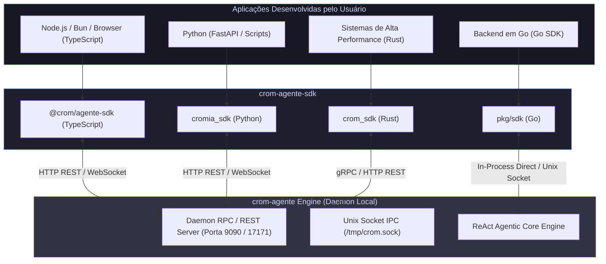

# 🌐 01. Visão Geral do `crom-agente-sdk`

Este documento apresenta a arquitetura multi-linguagem do **`crom-agente-sdk`**, detalhando como o SDK se conecta e interage com o motor local **`crom-agente`** em **TypeScript/Node.js**, **Go**, **Python** e **Rust**.

---

## 📑 Sumário
1. [Arquitetura Multi-Linguagem](#1-arquitetura-multi-linguagem)
2. [Linguagens Suportadas](#2-linguagens-suportadas)
3. [Protocolos de Comunicação (HTTP, gRPC, WebSockets, IPC Unix Socket)](#3-protocolos-de-comunicação)
4. [Tabela Comparativa de Recursos por Linguagem](#4-tabela-comparativa-de-recursos-por-linguagem)

---

## 1. Arquitetura Multi-Linguagem

O `crom-agente-sdk` é a camada de integração oficial do Ecossistema CromIA. Ele expõe bindings estruturados e idiomáticos para que desenvolvedores possam incorporar o motor de agentes autônomos locais em qualquer aplicação backend ou desktop.

---

## 2. Linguagens Suportadas

1. **TypeScript / JavaScript** (`@crom/agente-sdk` em `typescript/`): Suporte completo a Node.js, Bun, Vite, Tauri e navegadores, incluindo a classe `CromAgentEngine` e `CromClient`.
2. **Go** (`pkg/sdk` e `go/`): Bindings de alto desempenho *in-process* ou via Unix Socket, com suporte a registro de `customTools` nativas em Go.
3. **Python** (`cromia_sdk` em `python/`): Cliente assíncrono para Python 3.9+ com suporte a streaming de telemetria via WebSockets.
4. **Rust** (`rust/`): Cliente assíncrono baseado em `tokio` para integração com sistemas de altíssima performance.

---

## 3. Protocolos de Comunicação

O SDK se comunica com o motor através de 3 modos:
- **Direct In-Process (Apenas Go)**: Executa o loop ReAct diretamente dentro da memória da aplicação Go.
- **Unix Domain Socket IPC**: Comunicação ultra-rápida via arquivo de socket Unix (`/tmp/crom.sock`).
- **HTTP REST & WebSockets**: Comunicação via porta `9090` (ou `17171`), ideal para TypeScript, Python e Rust.

---

## 4. Tabela Comparativa de Recursos por Linguagem

| Recurso | TypeScript | Go | Python | Rust |
| :--- | :---: | :---: | :---: | :---: |
| **`CromClient` (Status / Telemetria)** | ✅ | ✅ | ✅ | ✅ |
| **`CromAgentEngine` (Zero-File & Ephemeral)** | ✅ | ✅ | ✅ | ✅ |
| **Filtro `toolsConfig` (`none`, `only`, `except`, `plus`)** | ✅ | ✅ | ✅ | ✅ |
| **Ferramentas Customizadas no Código** | ✅ | ✅ | 🟡 via MCP | 🟡 via MCP |
| **Streaming de Telemetria via WebSocket** | ✅ | ✅ | ✅ | ✅ |
| **Validação de Schema JSON (Zod/Pydantic)** | ✅ (Zod) | ✅ (Structs) | ✅ (Pydantic) | ✅ (Serde) |
