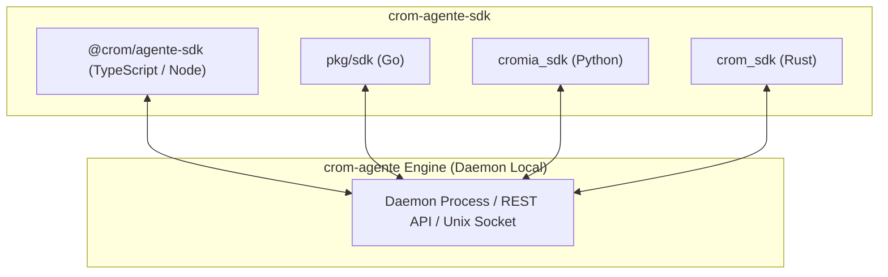

# 📚 Documentação Técnica do `crom-agente-sdk`

Bem-vindo à documentação técnica oficial da biblioteca **`crom-agente-sdk`**. Esta documentação cobre a integração programática com o motor autônomo em **TypeScript**, **Go**, **Python** e **Rust**.

---

## 🧭 Índice de Documentos do SDK

| # | Arquivo | Descrição |
| :---: | :--- | :--- |
| **01** | 🌐 [01_VISAO_GERAL_SDK.md](file:///home/j/Documentos/GitHub/crom-agente-sdk/documentacao/01_VISAO_GERAL_SDK.md) | Arquitetura multi-linguagem, suporte a TypeScript, Go, Python e Rust, e comunicação Daemon. |
| **02** | 📘 [02_TYPESCRIPT_SDK.md](file:///home/j/Documentos/GitHub/crom-agente-sdk/documentacao/02_TYPESCRIPT_SDK.md) | Referência completa do pacote `@crom/agente-sdk`, `CromAgentEngine`, `CromClient` e Zod validation. |
| **03** | 🦫 [03_GO_SDK.md](file:///home/j/Documentos/GitHub/crom-agente-sdk/documentacao/03_GO_SDK.md) | Bindings em Go (`pkg/sdk` e `go/`), `sdk.Manager`, `ExecuteTask`, `RegisterTool` e `LoadScriptsFromDir`. |
| **04** | 🐍 [04_PYTHON_SDK.md](file:///home/j/Documentos/GitHub/crom-agente-sdk/documentacao/04_PYTHON_SDK.md) | Guia do pacote `cromia_sdk` em Python, `CromClient`, FastAPI e streaming via WebSockets. |
| **05** | 🦀 [05_RUST_SDK.md](file:///home/j/Documentos/GitHub/crom-agente-sdk/documentacao/05_RUST_SDK.md) | Crate assíncrono em Rust (`rust/`) com `tokio` e `reqwest` para microsserviços de alta performance. |
| **06** | 🛠️ [06_FERRAMENTAS_CUSTOMIZADAS_E_SCRIPTS.md](file:///home/j/Documentos/GitHub/crom-agente-sdk/documentacao/06_FERRAMENTAS_CUSTOMIZADAS_E_SCRIPTS.md) | Como registrar ferramentas customizadas nativas em código e carregar scripts de um diretório. |
| **07** | 📊 [07_TELEMETRIA_E_WEBSOCKETS.md](file:///home/j/Documentos/GitHub/crom-agente-sdk/documentacao/07_TELEMETRIA_E_WEBSOCKETS.md) | Monitoramento de métricas em tempo real (`durationMs`, tokens, custo USD) e streaming WebSocket. |

---

## 🏗️ Arquitetura Multi-Linguagem do SDK

